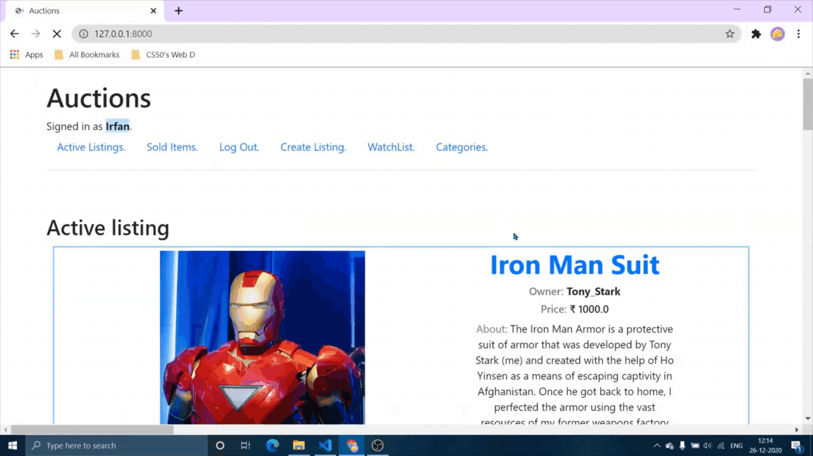
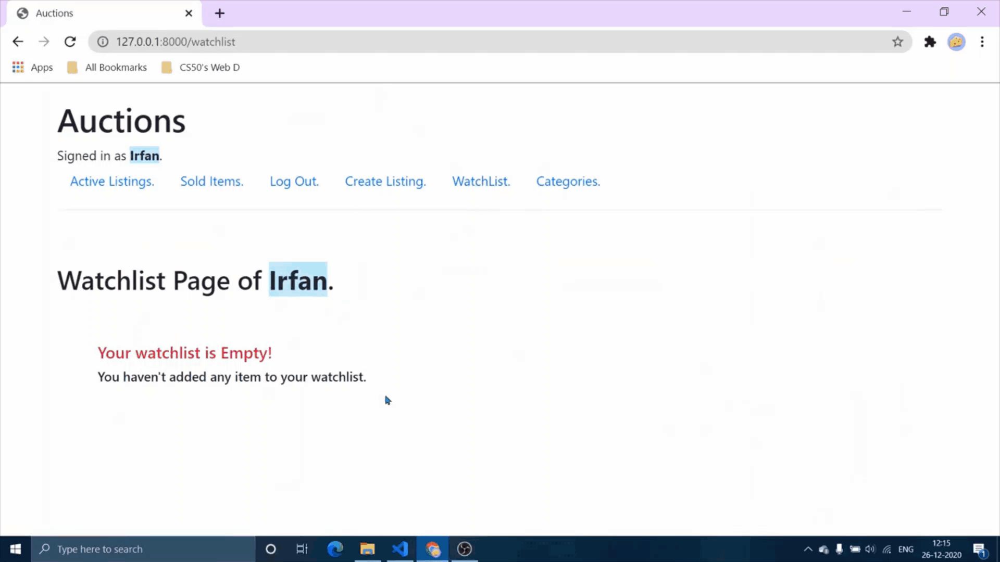

# Commerce
Design an eBay-like e-commerce auction site that will allow users to post auction listings, place bids on listings, comment on those listings, and add listings to a “watchlist.”

## Overview
Commerce is the second project for Harvard CS50's Web Programming with Python and JavaScript course.
The project specifications are listed [here](https://cs50.harvard.edu/web/2020/projects/2/commerce/).

## Project Demos
A [full demo of my project](https://youtu.be/zAKewnSbRw8) can be viewed on YouTube along with all [other CS50 Web Projects](https://www.youtube.com/playlist?list=PL6kIwIV_2O_gfcx46gplsaybo8c9vTb3d).

Note the quality of the following clips may be lower due to conversion from video to GIF format.  

### Active Listing

### Create New Listing

### Sold Listing

### Bid and Comment

### Watchlist

### Category

## Bug Reports and Improvements
If you experience any bugs or see anything that can be improved or added, please feel free to [open an issue](https://github.com/IrfanTheDev/Commerce/issues) here or simply contact me through any of the methods below.
 Thanks in advance!

Email: theirfan2020@gmail.com   
Linkedin: [https://www.linkedin.com/in/theirfanr/](https://www.linkedin.com/in/theirfanr/)

